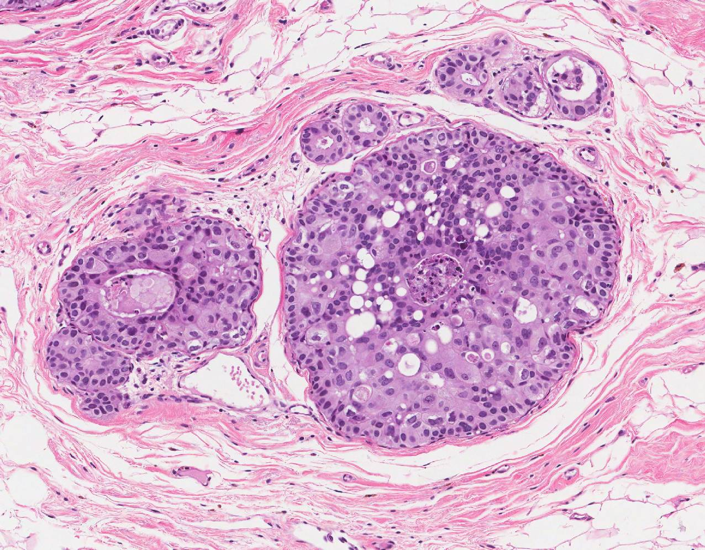

Machine Learning Project

Minor Artificial Intelligence

UvA

2020-2021

Histopathological cancer detection

Developing a convolutional neural network for the detection of breast cancer in
microscopic lymph node sections

# 

By Sasha Peerdeman, Tim Mooren and Jack Pieters

# Table of contents:

### Milestone 1 

### Ch. 1: Baseline model

### Milestone 2

### Ch. 1: Making the network architecture more complex

### Ch. 2: Tweaking the model hyperparameters

### Milestone 3

### Ch. 1: Cropping input images to Region of Interest (ROI)

### Ch. 2: Data augmentations

### Ch. 3: Deeper model architecture

### Ch. 4: Final model comparison

### Discussion

### Conclusion

# 

# 

# 

# 

# 

# 

#   

# Milestone 1: Baseline Model

### 1. The analysis of data and construction of features

Our dataset is a derivative of the PatchCamelyon (PCam) dataset, which is a
derivative of the Cancer Metastases in Lymph Nodes Challenge 2016 (CAMELYON16)
dataset.[1]

The CAMELYON16 dataset consists of 170 training and 129 testing, hematoxylin-
and eosin–stained (H&E) whole image slides (WSI). Hematoxylin binds to DNA,
colouring it purple. Eosin binds to amino acids found in cytoplasm, collagen and
muscle fibers, colouring them pink. Therefore, both the nucleus of each cell,
containing Hematoxylin bound DNA, and the surrounding cell structures are
visualized. All 400 slides were obtained from Radboud University Medical Center
(RUMC) and the Medical Center Utrecht (UMCU), which scanned the images with a
20x (0.243 µ/pixel) and 40x (0.226 µ/pixel) objective lens respectively. These
WSI were annotated by students, which were supervised and checked by
pathologist. [2,3]

*Figure 1: Example of effect of magnification. [7]*

**

**

*Figure 2: Example of WSI. Tumour tissue has been annotated in blue. [7]*

The PCam dataset consists of 327.680 96x96xp patches selected from the WSI in
CAMELYON16, at 10x magnification (0.972 µ/pixel). To filter out all the patches
containing the background and no tissue, all patches were converted from RGB to
HSV and blurred. Patches with a maximum pixel saturation of below 0.07 were
dropped, since these patches were believed not to contain any tissue.

Afterwards, patches were sampled for the dataset by iterating through the WSI
and choosing a negative patch with probability around 0.5. Because it’s a
probability, some patches could be selected twice and the dataset will contain
duplicates. Some patches are selected based on a CNN and a stochastic
hard-negative mining scheme. Hard-negative mining is a technique in which
training examples that a model has a hard time classifying correctly are
extracted from the larger dataset, since they might contain features that the
model can leverage to learn more effectively. [5,6] In this case specifically, a
CNN was trained using an annotated dataset (the patches) and false positives
with a prediction around 0.5, meaning they are hard to predict (e.g. lie close
to the decision boundary), were kept. [3,4] This technique results in a dataset
containing negative examples that are more difficult to distinguish from
positive examples, compared to the average negative example.

A patch was labelled positive, if there was at least one pixel of tumour tissue
in the 32x32 centre of the patch. In the PCam dataset, the entire 96x96 patch
was included. However, the tissue outside of the 32x32 center of the patch was
not taken into account when labelling the samples. Therefore, a 96x96 sample
containing tumor tissue only outside the centre did not receive a positive
label. This border was merely added to ensure the data could be used by models
that don’t use zero-padding on their images.[3]

*Figure 3: Example images from the PCam dataset. Centres of patches have been
coloured green.*

There is no overlap between training and testing data. All the duplicates are
taken out, leaving 277.483 unique 96x96px image samples. The Kaggle competition
has split this dataset into 220.025 (79%) training and 57.458 (21%) testing
images. The testing data is not labelled, since it is used to judge performance
in the Kaggle competition.[1] Both the training and testing data contained
around 50% positive examples (patches containing tumorous tissue) and 50%
negative examples. Closer inspection revealed that the ratio of positive to
negative samples was closer to 40:60.

We have split the labelled training dataset further, resulting in a training set
(70%, 154018 samples) and validation set (30%, 66008 samples), which we used to
evaluate the training of our model.

**

*Figure 4: Examples from our dataset. Left: negative training example. Middle:
positive training example. Right: testing example.*

### 2. The inputs and structure of the model

The input data is presented as tiff images of 32 x 32 pixels with 3 color
channels. The collection of tiff images was converted to a four-dimensional
Numpy array.

The dimensions of this Numpy array are as follows:

-   Dimension 0: The different images

-   Dimension 1: The columns of the images

-   Dimension 2: The rows of the images

-   Dimension 3: The three colour channels

Because the input data are images, a convolutional neural network (CNN) was used
as a model. The bare minimum for a neural network to be called a CNN is the
inclusion of 1 convolutional layer followed by a pooling layer, a flattening
layer, a hidden layer and an output layer. The convolutional layer creates a
feature map, based on convolutional filters defined during the learning process
of the neural network. Over time, the network changes the filters in order to
extract features in the input data which are relevant for the task at hand. In
our case, the network learns filters that extract features which hold
information that allows cancer cells to be distinguished from non-cancer cells.
The max pooling layers are included to increase abstraction, provide translation
invariance and reduce the number of computations needed in the model by reducing
the number of parameters.

Subsequent convolutional layers build upon the features extracted in previous
layers. With each convolutional layer addition, the learned features become more
abstract. The features also become more invariant to exact locations in the
input images. In many cases this is favorable. This applies to our case as well,
since cancer cells can appear in any region (in the center) of the input image.
Examples of features that the model might learn are certain characteristic cell
membrane shapes, sizes or hues. We have decided to include an extra
convolutional layer in our baseline model to increase the freedom of the model
in determining useful visual features for the detection of cancer cells.

There are no set rules for determining the initial number of filters. Large
amounts of filters pose no problem for NN’s, so we chose a number that was
large, but could still be further expanded. We also didn’t know how many
features we could distinguish in an image. Conventionally, the amount of filters
increases by a power of two with the addition of a new convolutional layer.

All throughout our model, ReLU activations are used. The exception to this rule
is the output layer, which consists of two nodes with a softmax activation. The
softmax activation reflects the probability predicted by the network that a
sample belongs to either the negative or positive class (absence/presence of
cancerous cells in the image).

The resulting network architecture of the baseline model is as follows:

Convolution and Max-pooling:

-   Convolutional layer 1 (32 filters)

    -   Applies convolutional filters resulting in 32 feature maps.

-   Max-pooling layer

    -   Applies Max-pooling to feature maps with 2x2 patch

-   Convolutional layer 2 (64 filters)

    -   Applies convolutional filters resulting in 64 feature maps.

-   Max-pooling layer

    -   Applies Max-pooling to feature maps with 2x2 patch

Dense layers:

-   Flatten layer

    -   Flattens the feature maps of the final convolutional layers into one
        vector which serves as input to the densely connected subsequent layer.

-   Dense (hidden) layer (64 nodes)

    -   Densely connected hidden layer.

-   Dense (output) layer

    -   Two output nodes (softmax activation), corresponding to the two possible
        classes (cancer/no cancer).

model = models.Sequential()

model.add(layers.Conv2D(32, (3, 3), activation='relu', padding='same',
input_shape=(32, 32, 3)))

model.add(layers.MaxPooling2D((2, 2)))

model.add(layers.Conv2D(64, (3, 3), activation='relu', padding='same'))

model.add(layers.MaxPooling2D((2, 2)))

model.add(layers.Flatten())

model.add(layers.Dense(64, activation='relu'))

model.add(layers.Dense(2, activation='softmax'))

train_and_evaluate(model, train_images, train_labels, val_images, val_labels)

### 3. The training methodology

For the baseline model, we used categorical cross entropy as loss function and
Adam as optimizer for gradient descent, since Adam seems to be a very efficient
optimizer in many situations. The learning rate for the Adam optimizer was set
to the default value of 0.001. We trained the CNN for 20 epochs.

### 4. Comparison to previous models and analysis of results

*Graph 1: Model loss and accuracy for the baseline model.*

Our baseline model performed surprisingly well. The final validation accuracy
was 84.5%, which is far above the 50% chance level for a binary classification
problem. While the training accuracy of the model seems to increase
monotonically, the validation accuracy fluctuates quite a lot. There are many
possible causes for a widely varying validation accuracy, such as overfitting or
an unrepresentative validation dataset.

For future models, we have outlined several tweaks which could speed up the
learning process and increase the generalizability of our model to the
validation data.

Possible tweaks:

-   Changing learning rate

    -   The learning rate of the adam optimizer is currently set to the default
        value of 0.001. Increasing the learning rate could perhaps speed up the
        training process.

-   Increasing number of epochs

    -   As the graph above shows, the training accuracy had not quite reached a
        plateau after 20 epochs. Therefore, this model might benefit from using
        more epochs in the training process. Furthermore, this is the most
        ‘basic’ model that we have designed. In later, more complex, iterations
        of our model, the model might require even more epochs to fully train.

-   Normalizing input

    -   To borrow some abstract terms from a theory video by Andrew Ng,
        normalizing the input features might aid the learning process since it
        might make the ‘landscape’ of our cost function more symmetrical.

-   Deepening the model

    -   Deepening the model by adding more layers increases the freedom of the
        model in designing a function that corresponds to the underlying
        distribution of our image data. For instance, adding more convolutional
        layers to the model might increase the ability of the model to learn
        relevant features in the training images that are predictive of the
        presence of cancerous cells.

-   Adding dropout layers

    -   That being said, increasing the complexity of the model also increases
        the model’s capacity for overfitting the training data. Our relatively
        simple baseline model already seems to be overfitting slightly, since
        the training and validation accuracies seem to diverge after around 10
        epochs. This might indicate that the model continues to change in a way
        that fits the training data more and more efficiently, but does not
        generalize well to the validation data. Therefore, the model might
        benefit from the regularizing effect of adding several dropout layers.
        The dropout layers might force the model not to rely too much on
        specific weights.

-   Adding batch normalization layers

    -   Our model uses ReLU activations after each of the convolutional layers
        and the dense layer. Therefore, normalizing the input (mean around 0 and
        standard deviation around 1) for each of these layers might speed up the
        learning process, as it might help the model leverage the non-linearity
        of the ReLU function near its origin. Batch normalization might also
        have a slight regularizing effect that our model could reduce
        overfitting in our model.

-   Data augmentations

    -   Cancer cells can come in many shapes, sizes and orientations. Therefore,
        using data augmentations which for instance zoom, rotate, flip, shift or
        shear the training images might result in a meaningful increase in the
        number of training examples our model can use to learn from. All of the
        abovementioned augmentations could result in new images of cancerous
        cells that are still biologically realistic.

-   Feature extraction

    -   Cancerous cells have defining visual features that can be determined by
        us humans. It might be possible to translate these visual features into
        filters that our neural network can use to learn more quickly and
        accurately.

-   K-fold cross validation

# Milestone 2: Actual model

## Chapter 1: Making the network architecture more complex

### 1. The analysis of data and construction of features

To aid us in the process of determining visual features that might be of
importance in this image classification task, we were lucky enough to have had a
short consultation session with a trained pathologist. At the scale of our image
data, which mostly captures small groups of individual cells, a pathologist
discerns between healthy and cancerous cells by looking at the following
features:

-   Cell nucleus size

-   Shape of the nucleus

-   Relative size of cell cytoplasm to nucleus (*cytonuclear ratio)*

-   Edge of nuclear membrane

-   The presence/absence of visible nucleoli (these structures become more
    visible in cancerous cells)

Cancer cells have a deregulated proliferation system and are constantly
multiplying. Since the DNA of a cancerous cell is constantly active, it is more
unraveled and spread out over the nucleus. Because the staining used in our
image data binds to the DNA, the nuclei of cancerous cells appear to be much
larger and lighter compared to healthy cells. Furthermore, the cytoplasm (the
liquid space outside the cell nucleus) of cancer cells is often much larger than
that of lymphocytes and the cancerous cells take on much more asymmetrical and
atypical shapes. Finally, nucleoli are more often visible in cancer cells since
these structures reside in a nucleus that is less densely packed compared to the
nucleus of healthy cells.

All of the above characteristics are biologically inspired visual features that
our model could potentially leverage to better learn to distinguish cancerous
cells from healthy cells, at the individual cell level. At a larger image scale,
a pathologist also looks at the relation between the different cells’ positions
and the structures they form. This will not be possible for our model, because
it is trained on images with insufficient scope. A 96x96 pixel patch often
contains only several cells, thus visual information on larger structures is
lost at this scale.

### 2. The inputs and structure of the model

### Network input

A very important change between the previous and the present milestone was made
by reevaluating the size of the training images. In designing the previous model
we mistakenly thought that the size of the input images was 32x32 pixels,
corresponding to the centers of the images on which the classification was
based. In reality the input images were actually the entire 96x96 pixels,
including the borders which do not influence the image classification. Since we
borrowed some code from the GTSRB notebook, we did not fully understand that we
were actually resizing these 96x96 pixel images to a 32x32 format. The image
sizes reported earlier in this document for the previous milestone have been
corrected.

Since it is likely that some important visual information is lost when an image
is resized to a much smaller resolution, we first tried to change the input back
to the original 96x96 image size. Unfortunately however, we ran into hardware
restrictions as this input size did not fit into the 35 gigabytes of memory in
Google Colab Pro. Due to these limitations, we decided to try resizing the
images to 48x48, in order to see whether this would result in a gain in model
accuracy. We applied this change to several of our models.

Resizing to 48x48 instead of to 32x32 did not significantly increase the
accuracy of our early models. Furthermore, training the models on 32x32 input
images was much faster than on 48x48 input images. Therefore, we chose to keep
the dimensions of our input images set to a 32x32 pixel format.

In future models, however, we want to attempt cropping the input images so that
only the 32x32 centers are included, eliminating the need for any resizing. The
motivation for this is twofold.

Firstly, since only the center of the images influences the classification, it
is possible that the borders of the images contain cells which conflict with the
center-based classification (e.g. cancerous cells in the borders of images
classified as healthy cells). This might cause the model to associate features
of the wrong type of cell with the wrong classification.

Secondly, the input images are quite small to begin with. Each of the input
images contains only a handful of cells. Therefore, each cell is represented by
only a few pixels. Since the model is likely distinguishing the cells based on
their individual characteristics rather than their relation to each other, the
scope of the images being too small to do the latter, it is important to retain
as much information as possible on the individual cell level. By only including
the center patches, we retain much more information on individual cell
architecture compared to when the full-size image is resized to fit into a 32x32
format.

Since we only noticed the actual size of the input images recently, the models
for this milestone are still based on 96x96 images resized to 32x32 pixel
format. These resized images are used to train and evaluate the following
models.

### Network architecture

We have built upon the architecture of our baseline model with incremental
changes in order to document the effect of each change in network architecture
individually. The motivations for each of the additions can be found in the
final section of the previous milestone. The order of additions to the network
architecture was as follows:

1.  Baseline model

2.  Input normalization

3.  Dropout layers

4.  Deeper network (two extra convolutional and max-pooling layers)

5.  Batch normalization

The additions of the above mentioned changes resulted in the following network
architecture:

model = models.Sequential()

model.add(layers.Conv2D(32, (3, 3), activation='relu', padding='same',
input_shape=(32, 32, 3)))

model.add(layers.MaxPooling2D((2, 2)))

model.add(layers.BatchNormalization())

model.add(layers.Dropout(0.2))

model.add(layers.Conv2D(64, (3, 3), activation='relu', padding='same'))

model.add(layers.MaxPooling2D((2, 2)))

model.add(layers.BatchNormalization())

model.add(layers.Dropout(0.2))

model.add(layers.Conv2D(128, (3, 3), activation='relu', padding='same'))

model.add(layers.MaxPooling2D((2, 2)))

model.add(layers.BatchNormalization())

model.add(layers.Dropout(0.2))

model.add(layers.Conv2D(256, (3, 3), activation='relu', padding='same'))

model.add(layers.MaxPooling2D((2, 2)))

model.add(layers.BatchNormalization())

model.add(layers.Flatten())

model.add(layers.Dropout(0.4))

model.add(layers.Dense(256, activation='relu'))

model.add(layers.Dropout(0.4))

model.add(layers.Dense(2, activation='softmax'))

train_and_evaluate(model, train_images, train_labels, val_images, val_labels,
preprocess={'featurewise_center': True, 'featurewise_std_normalization': True},
epochs=50)

### 3. The training methodology

All models were trained using the default hyperparameters (eg. LR: 0.001, SGD).

### 4. Comparison to previous models and analysis of results

#### Input normalization

https://github.com/timmooren/hispa-cancer-detection/blob/main/docs/images/milestone2/G2_preprossesing_LR_001_20_epochs_resize_32.png

*Graph 2: Model loss and accuracy for the preprocessing model.*

Thanks to the normalization of the input data, the network was able to learn
much quicker. This can be seen by the rapid increase in training accuracy as
compared to the model of the previous milestone (baseline model).

However, the validation accuracy reaches a plateau at some point, while the
training data increases steadily. This is a sign that the model is overfitting
to the training data. The overfitting starts around epoch 3 (as seen by the
naked eye).

#### Dropout

In order to counteract the overfitting seen in the last model, we have added
dropout to the network to increase its robustness.

*Graph 3: Model loss and accuracy for the dropout model.*

In correspondence with our hypothesis, using dropout as a regularization
technique brought the validation and training accuracy roughly on the same line
and scale again.

#### Deeper network

After having solved overfitting in the previous model, we made an attempt to
make the network deeper.

*Graph 4: Model loss and accuracy for the deeper model.*

As can be seen from the graph above, the validation accuracy starts to fluctuate
early on in the training process. Beyond the 20th epoch, even the training
accuracy starts fluctuating and decreasing. This problem can have a variety of
causes, which is why we started experimenting to see whether one of our
hypotheses could solve it.

#### Batch normalization

Our first approach to solve the strong fluctuation of training and validation
accuracy was to add batch normalization between different layers of the network.

*Graph 5: Model loss and accuracy for the batch normalization model.*

As can be seen from the graph above, batch normalization appears to stabilize
the training accuracy, but the validation accuracy is still fluctuating. In
general terms, we believe that the fluctuating validation accuracy could mean
that the features that the model learns based on the training data do not always
seem to apply as well to the different validation samples. This is a form of
overfitting which can be caused by many different issues and thus could
potentially be solved in many different ways.

However, one also has to take into account the key difference in which the
training accuracy and validation accuracy are computed. That is, while the
training accuracy at each epoch is an average of the accuracies for all updates
in that epoch (e.g. the average over close to 5000 updates in our case), the
validation accuracy is determined solely on the final parameter update of the
epoch. Therefore, the validation accuracy plotted in the graphs is much more
cross-sectional than the training accuracy. This means that the curve of
training accuracy might also contain more fluctuations than can be seen with the
naked eye.

## Chapter 2: Tweaking the model hyperparameters

After designing an increasingly complex network architecture and deciding upon
training the architecture outlined above, we attempted to tweak the training
process in several different ways.

### 1. The analysis of data and construction of features

#### Different splits of training data

Our data was split into 70% training data and 30% validation data randomly.
Since our training contains negative samples that were hard-mined it is possible
that these samples which are hard to classify are distributed unevenly across
the training and validation data. A hypothesis of ours was that in the specific
split we performed in training our models, the validation data possibly
contained relatively more difficult to classify examples (outliers). Since these
outliers lie close to the decision boundary drawn by the model, small changes in
model parameters might result in different predictions for these samples. As a
result, the validation accuracy might differ quite heavily between parameter
updates. Therefore, we tried several different random splits to determine
whether an unequal distribution of outliers might be the root cause of our
fluctuating validation accuracies.

### 2. The inputs and structure of the model

The model architecture used for this iteration is identical to that of the
previous iteration, since the focus for this iteration was directed at tweaking
the model’s hyperparameters.

### 3. The training methodology

#### Hyperparameters

In this milestone, we tweaked each of the hyperparameters individually to
determine which tweaks had the most beneficial effect on the learning of our
model. For the next milestone we intend to try out different combinations of
hyperparameter tweaks which might have a synergistic effect.

#### Learning rate

Another possible explanation for the fluctuations seen in the validation
accuracies of our models could be that the default learning rate of 0.001 for
the Adam optimizer was simply too large. Too large a learning rate could cause
the model to update the parameters too much after each iteration of gradient
descent. As a result, some updates might help the model converge while others
cause the model to diverge. Alternating convergence and divergence might also
explain the fluctuations in validation accuracy, since these accuracies are only
based on the final parameter update of any epoch. If the learning rate is
decreased, the model will update its parameters less drastically, hopefully
reducing the swings in validation accuracy. To determine whether learning rate
influenced the course of validation accuracies, we decreased the default value
of 0.001 to 0.0001.

#### Batch size

By default, the Adam optimizer uses stochastic gradient descent to train the
models. Since the parameter updates that the model makes during learning are
only based on one sample at a time, and since the individual samples can differ
quite a lot from each other, the model might perform quite varying updates at
each gradient descent step. Some of these steps might be beneficial to the
generalizability of the model, whereas others might harm it, which might cause
fluctuations in the validation accuracy. To counter possible harmful steps taken
by the stochastic gradient descent model, we experimented with several batch
sizes. The batch sizes we tried out were 10 and 50.

#### Weight regularization

Another way of making the model less prone to overfitting is L2 regularisation,
a form of weight regularization. When L2 regularisation is applied, large
weights are penalised. This results in weight decay, the reduction of a weight
to almost 0. Nodes with these very small weights can be interpreted as a
(nearly) dead node, which means it will not affect the resulting classification.
This reduces the size and complexity of the model, making it easier to
generalise to other data points. The scale of the penalisation is determined by
the hyperparameter lambda.

Regularisation might also affect the scale of fluctuation seen in the
validation. If the model generalises to other data, then the loss and accuracy
for different validation samples will not differ as much because the model fits
these samples better.

There are several ways to apply L2 regularisation to a model. It can be applied
to different layers and their lambda values could all be different. We have
chosen to apply L2 regularisation to the dense layer in the model, with a
standard lambda value. Presumably, adding L2 regularisation in the first
convolutional layers could lead to too much information loss.

### 4. Comparison to previous models and analysis of results

#### Different splits

The different random splits of the data into training and validation sets did
not change the learning of our model. Specifically, we hoped that using a
different split might solve the fluctuating validation accuracies that we
observed. Since the different splits did not seem to have any significant
beneficial effect, we disqualified this as a possible improvement to our model.

#### Learning rate 0.0001

**

*Graph 6: Model loss and accuracy for the batch normalization model with
learning rate = 0.0001.*

Looking at the graph, it appears that decreasing the learning rate from 0.001 to
0.0001 can help with reducing the fluctuation of the validation accuracy. It is
noteworthy that the fluctuation decreases near epoch = 20, and then steadily
increases again. A possible explanation may be the algorithm is overfitting from
this point on, but other factors may be at play as well. For the next milestone
we will try if an even lower learning rate or a combination with more
regularization can help in smoothing out the validation accuracy curve.

#### Batch size 10

We tried 2 different batch sizes (10 and 50) to assess the effect of mini-batch
size on the fluctuations and accuracy.

*Graph 7: Model loss and accuracy for the batch normalization model with batch
size 10*

Comparing this 10-batch model to the batch normalised model, the scale of the
fluctuations in loss has become smaller, while the scale of the fluctuations in
accuracy have stayed mostly the same.

Batch size 50

*Graph 8: Model loss and accuracy for the batch normalization model with batch
size 50*

Compared to the 10-batch model, the scale of loss fluctuations has increased.
The validation accuracy has increased, but the scale of fluctuation hasn’t
changed much.

Sadly, both graphs present a very irregular pattern for validation loss and
accuracy. It still hasn’t completely solved the problem of a fluctuating
validation. Accuracy has not increased overall either.

#### L2 Regularization

*Graph 9: Model loss and accuracy for the batch normalization model with L2
normalization*

L2 regularisation did not result in less fluctuations and better accuracy.
Perhaps the model is still too complex even after this regularisation. Or the
weights could not be the issue. In the future lambda could be tweaked to
increase the rate of weight decay.

#### Conclusion

As of now, it appears that the most useful hyperparameter to adjust is the
learning rate. For the upcoming improvements of our model, we will experiment
further with the learning rate and other possible combinations of hyperparameter
configurations. Furthermore, we will attempt to crop the input images so that
only the classification-defining centers of the images will be taken into
account. Finally, we will start to apply several different data augmentations to
our training data.

# Milestone 3: Improved Model

As a preface to the following chapters, it might help to give a quick overview
of the model on which the following experiments are performed. We expanded upon
our baseline model by iteratively adding input preprocessing, dropout layers,
extra convolutional layers, and batch normalization layers. Thus, the
experiments below are performed on this network architecture.

## Chapter 1: ROI

### 1. The analysis of data and construction of features

#### Cropping v.s. Resizing

In the previous iterations of our model, the original 96x96 input images were
resized to a 32x32 format using the resize function of the CV2 (for computer
vision) package. Since only the 32x32 image centers were used in the
classification of the images, we attempted to crop out these centers instead of
resizing the entire image. As a result, the number of cells the model is trained
on decreases but we hypothesized that the features of these cells would be more
distinct, because a single cell would comprise more pixels.

By only cropping out the 32x32 pixel centers we could potentially lose valuable
information in the edges surrounding the classification-defining centers.
Namely, if a cancer cell falls only partly within the center, some of its pixels
will lie in the border surrounding the center. Since we hypothesized that a
32x32 pixel crop was potentially too narrow, we also experimented with a 48x48
pixel crop, in an attempt to retain some of the valuable border information.

### 2. The inputs and structure of the model

The code that loads the data was altered to include a function that crops the
images to a specified size. To the original load_data() function, an if
statement using a bool parameter was added to allow for easy switching between
cropping and resizing. The model architecture used for this iteration is
identical to that of the previous iteration, since the focus for this iteration
was directed at changing the input data.

### 3. The training methodology

Both models (32x32 and 48x48) were trained for 40 epochs, using default
hyperparameters (LR: 0.001, SGD, no L2).

### 4. Comparison to previous models and analysis of results

The 32x32 cropped image model exhibited lower training and validation accuracy
than previous models. Concurrently, both the training and validation loss
increased, compared to the model that used resized instead of cropped images.
Therefore, cropping the images to only the 32x32 image centers did not confer
any benefit to the performance of the model.

This decrease in performance might be due to information loss as a result of the
cropping process. An image is labeled positive if at least one of the center
pixels belongs to a cancer cell. Since a cancer cell could be positioned at the
border of the center patch, large parts of the cell are potentially lost by
cropping exactly at this border.

*Graph 10: Model loss and accuracy for the model with crop size 32x32*px

Overall, the training loss and accuracy of the 48x48 model seems to be better
than the 32x32 model. However, performance is still worse than the model trained
on resized rather than cropped images. Upon consultation with the teachers, we
learned that the resize function (of the CV2 package) used on our dataset
actually retains a large amount of the original visual information of the image
when resizing. Therefore, a relatively crude cropping procedure such as the one
we developed likely results in more information loss than a professionally
developed resizing procedure such as the CV2 resize.

*Graph 11: Model loss and accuracy for the model with crop size 48x48*px

To conclude, neither a 32x32 or 48x48 pixel cropping procedure of the input
images seem to confer any benefit to the performance of our model. Therefore, we
decided to continue using the CV2 resizing function for the remainder of our
models.

## Chapter 2: Data augmentation

### 1. The analysis of data and construction of features

The scope of our input data only captures the morphology of individual cells,
rather than the configuration of multiple cells into larger recognizable
biological structures. As a result, no important information would be lost if
the cells were to be flipped, rotated or slightly zoomed. Borrowing terms from
Veeling et al. [4], the whole slide images, or WSI’s, from which our input
images are extracted are said to exhibit translational, rotation and reflection
symmetry. In theory these augmentations would therefore result in an increase of
input data for our model, while retaining biological plausibility.

Therefore, we chose to analyse preliminarily what effects these three data
augmentations would have on the learning process of our model. If any of the
above data augmentations holds potential, we aim to apply it to our final
optimized model in a last attempt to further increase performance.

### 2. The inputs and structure of the model

Using the architecture of the model outlined in milestone 2, three individual
models were made using the following data augmentations:

1.  Horizontal and vertical flip

2.  Zoom range (0.2)

3.  Rotation range (20 degrees)

### 3. The training methodology

All models were trained using the default hyperparameters (eg. LR: 0.001, SGD,
no L2). Models 1, 2, and 3 were trained for 70, 60 and 40 epochs respectively.

### 4. Comparison to previous models and analysis of results

*Graph 5: Model loss and accuracy without data augmentations*

**

*Graph 12: Model loss and accuracy with horizontal and vertical flip
augmentations*

**

*Graph 13: Model loss and accuracy with zoom range augmentation*

As can be seen in the graphs above, the results for the horizontal and vertical
flip condition and the zoom range condition do not differ much from the results
of the model without any data augmentations. The model without any augmentations
even seems to have a more stable loss trajectory than the above-mentioned
models. As we still intend to run our best models with an increased number of
epochs, the data augmentations could perhaps confer a benefit by allowing our
model to continue training for longer, because of the increased training
dataset.

*Graph 14: Model loss and accuracy with rotation range augmentation*

The model containing rotated input images performed significantly worse than the
model without augmentations and the other two models with flipped and zoomed
images. A likely explanation for this drop in performance is the fact that the
images were rotated randomly in a 20 degree range, rather than rotated only a
full 90, 180, or 270 degrees. When square input images are rotated for anything
other than these three degrees, the resulting image is not square anymore. As a
consequence, when the image is used as input for a model expecting a square
input image, any parts of the image protruding from the 32x32 square format will
be cropped off. Conversely, any of the missing corners are replaced by entirely
black or white pixels. (illustration below) Since these pixels do not represent
any of the original information of the image, a lot of information is lost. We
were not aware of this fact upon running this model. If time allows, we would
like to run a model which only performs rotations of 90, 180, or 270 degrees.

*Figure 5: Rotated image overlaid on square input format*

## Chapter 3: Deeper Model

### 1. The analysis of data and construction of features

For this chapter, there are no changes in data analysis.

### 2. The inputs and structure of the model

For this chapter, we attempted a final addition to the network architecture.
Previously, our models seemed to be stranded just below 90 percent validation
accuracy. In an attempt to give our model more freedom in combining the features
learned in the convolutional layers, we designed a slightly deeper version of
the batch normalization architecture of the previous chapter by adding a second
densely connected hidden layer with 256 nodes. Initially both hidden layers were
given a dropout rate of 40 percent. Due to an indication of overfitting, we
increased the dropout rate of the final two layers to 60 percent.

The resulting network architecture is as follows.

model = models.Sequential()

model.add(layers.Conv2D(32, (3, 3), activation='relu', padding='same',
input_shape=(32, 32, 3)))

model.add(layers.MaxPooling2D((2, 2)))

model.add(layers.BatchNormalization())

model.add(layers.Dropout(0.2))

model.add(layers.Conv2D(64, (3, 3), activation='relu', padding='same'))

model.add(layers.MaxPooling2D((2, 2)))

model.add(layers.BatchNormalization())

model.add(layers.Dropout(0.2))

model.add(layers.Conv2D(128, (3, 3), activation='relu', padding='same'))

model.add(layers.MaxPooling2D((2, 2)))

model.add(layers.BatchNormalization())

model.add(layers.Dropout(0.2))

model.add(layers.Conv2D(256, (3, 3), activation='relu', padding='same'))

model.add(layers.MaxPooling2D((2, 2)))

model.add(layers.BatchNormalization())

model.add(layers.Flatten())

model.add(layers.Dropout(0.6))

model.add(layers.Dense(256, activation='relu'))

model.add(layers.Dropout(0.6))

model.add(layers.Dense(256, activation='relu'))

model.add(layers.Dropout(0.6))

model.add(layers.Dense(2, activation='softmax'))

train_and_evaluate(model, train_images, train_labels, val_images, val_labels,

preprocess={'featurewise_center': True, 'featurewise_std_normalization': True},
epochs=70, l_rate=0.0001)

### 3. The training methodology

The model was initially trained with 40 percent dropout, a learning rate of
0.0001 and 70 epochs (SGD, no L2). Because the validation loss and accuracy were
fluctuating a lot, we increased the dropout rate to 60 percent to see whether
this had an effect.

### 4. Comparison to previous models and analysis of results

#### Dropout rate of 40 percent

*Graph 15: Model loss and accuracy for the even deeper model with dropout = 0.4*

Judging from the above graphs, a deeper network with a dropout rate of 40
percent does not perform better than the model of the previous milestone.
However, we also ran the same model with a dropout rate of 60 percent to
compensate for potential for overfitting brought about by increasing the adding
the extra hidden layer. This produced the graph below.

#### Dropout rate of 60 percent

*Graph 16: Model loss and accuracy for the even deeper model with dropout = 0.6*

Although the performance of the model has not increased, the validation loss and
accuracy appear to be fluctuating less in this graph as compared to the model
with a dropout of 40 percent. Moreover, it also appears to be more stable than
the model of the previous milestone. Because of these results, this model became
one of the two contestants for our final model.

## Chapter 4: Final Model Comparison

### 1. The analysis of data and construction of features

For this chapter, there are no changes in data analysis. In an earlier
milestone, we stated that we would have liked to include data augmentations in
the final versions of our model. Due to time constraints, however, we have
decided to run these final models without any data augmentations. Moreover, we
chose to exclude the data augmentations as the preliminary results did not offer
strong convincing evidence of their effectiveness on our dataset.

### 2. The inputs and structure of the model

Of all the models we have developed during the course of this project, we have
selected two models that had both the highest and most stable validation
accuracy.

The following models were compared:

-   Batch normalization with a lower learning rate (0.0001) and dropout rate of
    40 percent.

-   Batch normalization model with a lower learning rate (0.0001), an extra
    hidden layer and a dropout rate of 60 percent.

### 3. The training methodology

In an attempt to maximize the potential of our two most effective models thus
far, we decided to run both of these models for an increased number of epochs.
The number of epochs was set to 100, which we believed would help our models to
learn as much as the time constraints of this project allowed.

### Metrics

Since the validation accuracy of our two final models is on the same level,
introducing a new metric might help us decide which model is the best fit for
our purposes.

In order to determine which of the built in Keras metrics is most important for
our model, we have to evaluate the relative importance of false positives, false
negatives, true positives and true negatives, since different metrics reflect
(some of) these different results. In a real-world application, our model would
be a screening tool for pathologists, where predictions of cancerous regions
would be forwarded to the pathologist who in turn makes a final evaluation.

In cases of true positives of the network, the pathologist could confirm the
prediction, saving the time the pathologist would need to find this region in a
large image. In case of false positives, the region proposed by the network can
be ruled out from the area the pathologist needs to examine, and the pathologist
can continue examining the leftover area.

In the case of a true or false negative, no (or little) time is saved, as the
pathologist would still need to examine the area more thoroughly to assure that
no cancerous tissue is present. So true positives save the most time, as true
negatives need a more thorough confirmation. False positives and false negatives
save no time at all. That being said, false positives can be seen as a necessary
evil in order not to miss any cancerous cells. To conclude, it would make the
most sense to design a model which is very sensitive to the detection of cancer
cells, since the emphasis in a clinical setting is on making sure whether cancer
is present or not. Therefore, it is worth the extra time needed to reevaluate
possible false positives. Thus, the sensitivity of the model is more important
than its specificity for our purposes.

Since the recall metric reflects the sensitivity of the model, we decided to
include this metric in the evaluation of our two favorite models. We attempted
to include a confusion matrix as well, but unfortunately we did not succeed in
producing an accurate matrix in time.

### Section 4: Model evaluation

#### Batch normalization model

*Graph 17: Model loss, accuracy and recall for batch normalization network (100
epochs)*

The greater number of epochs allowed for this model did not significantly
increase the validation accuracy. We had hoped that the validation accuracy
would continue to rise together with the training accuracy, but the two seem to
diverge over time, indicating that the model is likely overfitting to the
training data.

#### Deeper batch normalization model

)

*Graph 18: Model loss, accuracy and recall for deeper batch normalization
network (100 epochs)*

The validation accuracies of the deeper model and the more shallow model are
very similar. The recall, however, seems to be higher and more stable in the
deeper model, making this the optimal model for our purposes.

The deeper batch normalization model seems to overfit less strongly than the
more shallow model. It is likely that this is a result of the higher dropout
rate (60 vs. 40 percent). Perhaps if the dropout rate of the more shallow model
was set to 60 instead of 40 percent as well, it would have shown less
overfitting. Since the more shallow model did not show strong overfitting when
trained on less epochs, increasing the dropout rate was not something we
initially considered. Unfortunately, due to time constraints it is not possible
to run this model again with a higher dropout rate.

#### AdaDelta instead of Adam

As a final little experiment, we decided to change the optimizer used in the
training process. Since the learning rate seemed to be the most useful
hyperparameter to tweak, we decided to try out the AdaDelta optimizer instead of
the Adam optimizer. The AdaDelta optimizer continually adapts the learning rate
after every epoch. This could serve as a possible solution to the fluctuation of
the validation loss and accuracy seen in many of our models.

)

*Graph 19: Model loss, accuracy and recall for AdaDelta batch normalization
model*

*Graph 20: Model loss, accuracy, and recall for deeper AdaDelta batch
normalization model*

While the training and validation accuracies definitely fluctuate less than in
the models using the Adam optimizer, AdaDelta did not result in an increase in
performance in either of our two best models. Learning seems to take place at a
much slower pace. Upon discussing this step with one of the teachers, we learned
that while the Adam optimizer does not adapt the learning rate directly, it does
implement a form of momentum, which indirectly allows it to influence the size
of the steps taken by the algorithm. All in all, the Adam optimizer seems to be
a much more efficient optimizer than AdaDelta for our models.

# Discussion

The limiting factor of time applies to the development of machine learning
models as much as to any other facet of life. Given more time, there are several
plans which we would have loved to try out to make our model an even more
effective tool.

With regards to training the model, we would have tweaked the hyperparameters
further, trying out combinations of tweaks which might work synergistically (L2
regularization, lower learning rate, batch size). Moreover, since the models
that were trained for 100 epochs seemed to plateau at some point, we would have
included several data augmentations in improved form (e.g. only 90 degree
rotations). These augmentations could have potentially allowed our model to
continue learning relevant features for longer before reaching a plateau.

As for the predictions of our model, we would have liked to analyse these more
thoroughly. We were attempting to create a confusion matrix to determine the
ratios of true to false positives and negatives, to give us a better indication
of the types of errors our model is prone to making. Furthermore, we would have
liked to compare the exact predictions of several different models to see
whether and if so, how these predictions differed between models. Finally, if
time had allowed it, we would have loved to select several of the samples which
our model had a hard time classifying and discuss these samples with our expert
pathologist to determine whether the strengths and shortcomings of man (woman in
our case) and machine align or differ.

# Conclusion

After having designed and evaluated no less than 20 different model
configurations, the model which seemed to perform best was model number 18. This
model built upon a previous iteration by adding a second hidden layer. While the
validation accuracies of this deeper model and its predecessor seemed to be very
similar, the former achieved slightly higher recall. We believe that the higher
recall of this model reflects an increased sensitivity in the detection of
cancer cells in our input images that is a beneficial quality for a screening
tool applied in a clinical setting. If a screening tool is relied on by medical
professionals for the fast identification of cancerous tissue in tissue samples
taken from patients, it is imperative that such a tool do not miss any cancerous
tissue, as this can have dire consequences. Conversely, the cost of several more
false positives is not nearly as high, simply costing the medical professional
slightly more time.

Our final model reached a validation accuracy of approximately 93%. The
corresponding recall for this iteration of the model was approximately 90%.
While these numbers are quite impressive, given the relatively short period
allowed for the development of these models, the models are not quite sensitive
enough yet to be deployed independently in the clinic. However, if one were to
develop a practical user interface for a fully trained model, we believe that
convolutional neural networks could serve as a powerful tool for oncologists and
pathologists in the clinic of the future.

References:

>   1\. 
>   <https://www.kaggle.com/c/histopathologic-cancer-detection/overview><https://www.kaggle.com/c/histopathologic-cancer-detection/overview>

>   2\. Ehteshami Bejnordi et al. Diagnostic Assessment of Deep Learning
>   Algorithms for Detection of Lymph Node Metastases in Women With Breast
>   Cancer. JAMA: The Journal of the American Medical Association, 318(22),
>   2199–2210.
>   <https://doi.org/10.1001/jama.2017.14585>[doi:jama.2017.14585](https://doi.org/10.1001/jama.2017.14585)

>   3\. <https://github.com/basveeling/pcam>

>   4\. Veeling, B. S., Linmans, J., Winkens, J., Cohen, T., & Welling, M. (2018,
>   September). Rotation equivariant CNNs for digital pathology. In
>   *International Conference on Medical image computing and computer-assisted
>   intervention* (pp. 210-218). Springer, Cham.
>   <http://arxiv.org/abs/1806.03962>[arXiv:1806.03962](http://arxiv.org/abs/1806.03962)

>   5.
>   <https://stats.stackexchange.com/questions/294349/hard-mining-hard-examples-does-hard-mean-anything-specific-in-stat>[SP2]

>   6.
>   [https://sci-hub.se/https://www.sciencedirect.com/science/article/abs/pii/S0925231219316984](https://sci-hub.se/https:/www.sciencedirect.com/science/article/abs/pii/S0925231219316984)

>   7\. 
>   <https://camelyon16.grand-challenge.org/Data/><https://camelyon16.grand-challenge.org/Data/>
